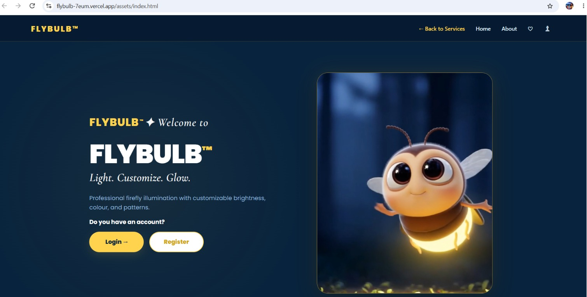
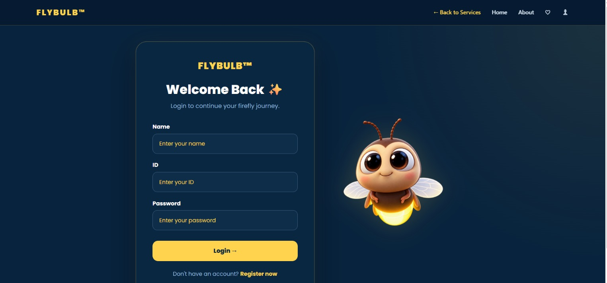
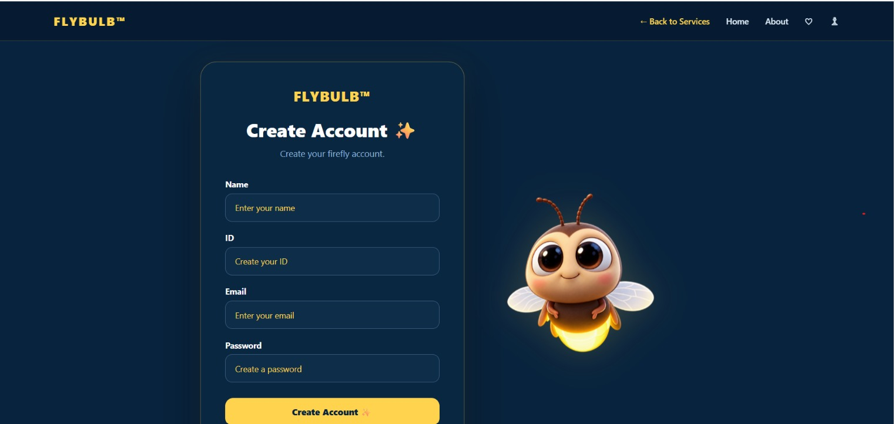

# FLYBULB™ 


## Basic Details
### Team Name: EvAnn


### Team Members
- Team Lead: Ann Maria Johny - Sahrdaya College of Engineering and Technology
- Member 2: Eva Rose Nellissery - Sahrdaya College of Engineering and Technology

### Project Description
**FLYBULB™** is a fictional online service platform designed to provide professional illumination services for fireflies.
Users can explore and purchase services such as **bulb replacement, brightness adjustment, and color change**, all through a playful and interactive web experience designed around the idea of giving every firefly the glow it deserves.

### The Problem (that doesn't exist)
What happens when your firefly's glow is just... not glowing enough?
Humans have access to bulbs, lamps, LEDs, smart lighting and endless lighting solutions. But what about fireflies?
A firefly might wake up one day and think:
> "My glow is looking a little dim today."
Unfortunately, there is no dedicated online platform for solving this extremely serious crisis.
**FLYBULB™ exists to solve this completely unnecessary problem.**

### The Solution (that nobody asked for)
FLYBULB™ provides a fictional online service platform where firefly owners can:

- Replace their firefly's bulb.
- Adjust the brightness of its glow.
- Change the color of its illumination.
- Explore different service packages and pricing.
- Navigate through a complete service-oriented web platform.

Because apparently, even fireflies deserve premium lighting services.

## Technical Details
### Technologies/Components Used
For Software:
- **HTML5** - Structure and content of the website
- **CSS3** - Styling, responsive layouts, animations and visual effects
- **JavaScript** - Interactions, form functionality, password visibility and dynamic website behaviour
- **Visual Studio Code** - Development environment
- **Git & GitHub** - Version control and project collaboration
- **MP4 Video Assets** - Firefly animations and visual elements
- **PNG Image Assets** - FLYBULB™ branding and firefly logo

# Installation

There is nothing to install — the project has no dependencies. Just clone the
repository:

```bash
git clone https://github.com/evarose22007-sketch/FlyBug_EvAnn.git
cd FlyBug_EvAnn
```

# Run

Open the entry page in any modern browser:

```bash
# macOS
open assets/index.html

# Windows
start assets\index.html

# Linux
xdg-open assets/index.html
```

Or run a small local server, which is the more reliable option because the
welcome video and the saved-account features behave better on a real origin:

```bash
python3 -m http.server 8000
# then open http://localhost:8000/assets/index.html
```

**First run:** click **Register**, create an account, then log in with the same
name, ID and password. Accounts are stored in your own browser only — nothing is
uploaded anywhere.

### Live Demo

**Visit the deployed website:**  
[FLYBULB™ on Vercel]([YOUR-VERCEL-LINK](https://flybulb-7eum.vercel.app/))

### Project Structure

```
FlyBug_EvAnn/
├── assets/
│   ├── index.html              welcome, register, login and services dashboard
│   ├── style.css               shared styling for every page
│   ├── logo.png                FLYBULB™ firefly logo
│   └── firefly-welcome.mp4     animated firefly on the welcome screen
├── Bulbreplacement/
│   └── index.html              bulb replacement service
├── brightnessadjustment/
│   └── index.html              brightness adjustment service
├── colourchange/
│   └── index.html              colour change service
├── about.html                  about the project
└── README.md
```

### How it works

`assets/index.html` holds four screens — welcome, register, login and the
services dashboard — as separate `<section>` elements. JavaScript shows one at a
time by adding and removing a `hidden` class, so the whole account flow happens
without a page reload.

Registration saves the account to `localStorage` under `flybulbAccount`. Logging
in checks the entered ID and password against that saved account, greets the
user by name on the dashboard, and unlocks the three service cards. Each card
links to its own page.

---

### Project Documentation
For Software:

# Screenshots (Add at least 3)

*The welcome page serves as the entry point to FLYBULB™. It introduces the platform and allows users to proceed to either Login or Register.*


*The login page allows existing users to access their FLYBULB™ account using their registered credentials.*


*The registration page allows new users to create a FLYBULB™ account by entering their required details and providing their Firefly's name.*

### Project Demo
# Video
Watch the complete FLYBULB™ website demonstration:
[Watch FLYBULB™ Demo](video/flybulb-demo-compressed.mp4)
*This video demonstrates the main features and user flow of the FLYBULB™ web service, from registration and login to exploring the available services.*
## Team Contributions

- **Ann Maria Johny:** page structure and HTML across the site, the three service pages, registration and login logic, service navigation.
- **Eva Rose Nellissery:** visual design and the stylesheet, welcome screen and firefly animations, logo and branding assets, README and documentation.

---

Made with ❤️ at TinkerHub Useless Projects 


